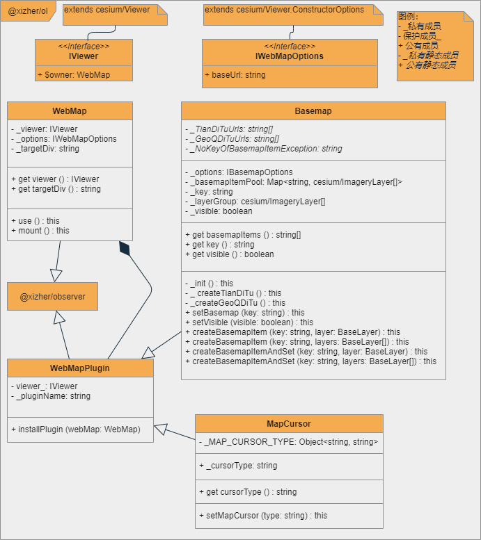

# @xizher/cesium

## 介绍

基于Cesium的业务功能型二次开发地图库，集成包括**地图底图控制**、**地图鼠标样式控制**等功能，这些功能可通过<u>*插件*</u>方式按需引入到地图库统一入口类WebMap中。

## 安装

```bash
npm install @xizher/cesium
```

## 使用

```javascript
import {
  WebMap,
  MapCursor,
  Basemap,
} from '@xizher/cesium'

const webMap = new WebMap('cesium-container')
  .use(new Basemap())
  .use(new MapCursor())
  .mount() // 当document渲染完成时执行 mount

// 例子：底图控制
webMap.basemap.setBasemap('xxx')
webMap.basemap.setVisible(true)
// ...

// 例子：地图鼠标样式控制
webMap.mapCursor.setCursor('xxx')
// ...
```

## 插件

### Basemap 底图控制插件

默认底图项：

- 天地图影像
- 天地图影像含注记
- 天地图矢量
- 天地图矢量含注记
- 天地图地形
- 天地图地形含注记
- 彩色地图
- 灰色地图
- 蓝黑色地图
- 暖色地图

监听项：

-  `'change': { key: string, visible: boolean }` → 当前显示底图项变化或底图可见性变化触发

-  `'change:key': { key: string }` → 当前显示底图项变化触发

-  `'change:visible': { visible: boolean }` → 底图可见性变化触发

### MapCursor 地图鼠标样式控制插件

鼠标样式可选项

- `'default'`

- `'pan'`

- `'panning'`

- `'wait'`

- `'draw'`

- `'zoomin'`

- `'zoomout'`

- `'clear'`

监听项：

-  `'change': { type: MapCursorType }` → 当前地图鼠标样式变化触发

## UML



## TODO

- 地图工具链插件（MapTools）